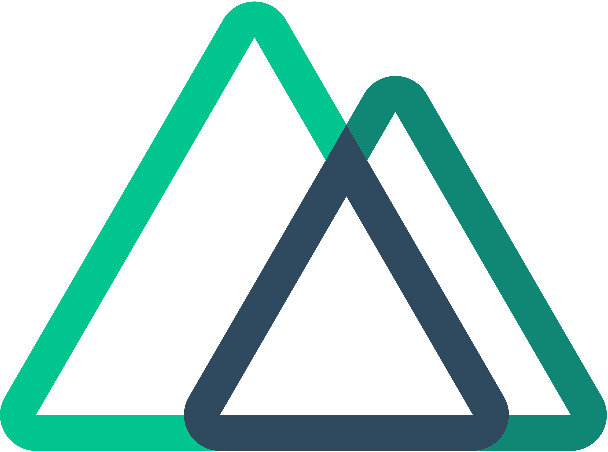

Hello there 👋 My name is Andrew
================================
Software Engineer @ Lockheed Martin
-----------------------------------
* 💻 Currently working on an online chess website (still needs a good name)
* 🌱 Teaching myself Golang and Vue.js
* 📫 How to reach me: Email or Linkedin
* 💡 Always looking for opportunities to grow

### Skills

  
  
  
  
  
  

